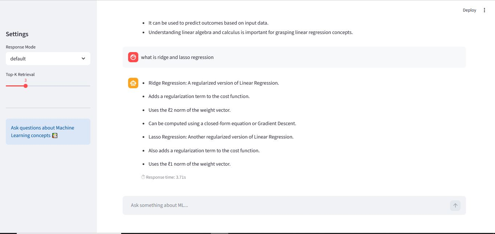

# 🚀 RAGnosis – Optimized RAG-based Knowledge Retrieval System

RAGnosis is a high-performance Retrieval-Augmented Generation (RAG) system designed for low-latency, context-aware question answering using LLMs. It combines semantic search with optimized retrieval and evaluation techniques to deliver fast and accurate responses.

---

## 📸 Demo



--- 

## 🔥 Key Features

- ⚡ Low-latency responses (~3 seconds)
- 🎯 100% retrieval hit rate
- 🧠 LLM-based answer generation (OpenAI)
- 🔍 Semantic search using FAISS + embeddings
- 📊 Custom evaluation framework (LLM-as-a-judge)
- 🛠 Optimized pipeline with context pruning and caching

---

## 🏗️ Architecture

User Query  
↓  
Retriever (FAISS + Embeddings)  
↓  
Top-k Documents (k=2)  
↓  
Context Formatting  
↓  
LLM (OpenAI GPT)  
↓  
Final Answer  

---

## 🛠️ Tech Stack

- **Backend:** FastAPI  
- **LLM:** OpenAI (gpt-4o-mini)  
- **Vector DB:** FAISS  
- **Embeddings:** Hugging Face (all-MiniLM-L6-v2)  
- **Framework:** LangChain  
- **Evaluation:** Custom LLM-based scoring  

---

## 📊 Performance

| Metric | Value |
|--------|------|
| Retrieval Hit Rate | 100% |
| Average Answer Score | ~4.3 / 5 |
| Average Latency | ~2 seconds |

---

## ⚡ Optimization Highlights

- Reduced latency from **~50 seconds → ~2 seconds**
- Tuned retrieval parameter (`k=2`) for optimal performance
- Applied **context trimming** to reduce token usage
- Cached vector store and embedding model for faster inference

---

## 🚀 Deployment

Backend deployed using **Render** with FastAPI.

---

## 💻 Run Locally

```bash
git clone https://github.com/sdntheone/RAGnosis.git
cd RAGnosis

pip install -r requirements.txt

uvicorn main:app --reload